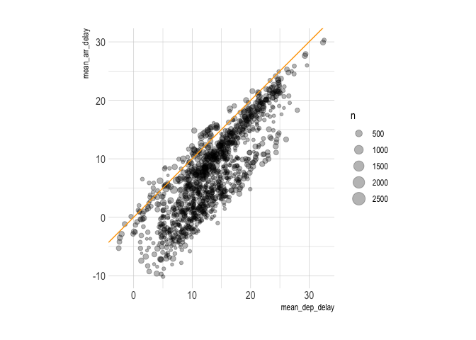

Databases
================

## Databases 101

Many “big data” problems could be described as “small data problems in
disguise”, meaning the data we care about is just a small subset or
aggregation of a larger dataset. For example, we might want to access US
Census data…but only for a few counties along a state border. Or, we
might want to analyze climate data collected from many weather
stations…but aggregated to the national/monthly level. In these cases,
the bottleneck is interacting with the original data, which is too large
to fit in memory. We can store and access this data with **relational
databases**.

Databases can exist locally or remotely (though remotely is more
common). They are stored *on-disk* somewhere, rather than in-memory. We
extract the information we want by submitting a *query* to the database.
In the query, we can request that the data be manipulated or subsetted
in a certain way before it is delivered to us.

**A table in a database is like a data frame in an R list.**

## Databases and the tidyverse

**dbplyr** allows for direct communication with databases from your
local R environment. It’s provides a database backend to **dplyr**. It
depends on the **DBI** package, which provides a common interface to
allow **dplyr** to work with many different databases using the same
type of code.

For **DBI** to work, you must install a specific backend package for the
type of database you want to connect to.
[Here](https://db.rstudio.com/dplyr/#getting-started) is a list of
commonly used backend packages. We will use:

  - **RSQLite**, which embeds a SQLite database.
  - **bigrquery**, which connects to Google BigQuery.

SQLite is a lightweight SQL database engine that can exist on our local
computers (no need to connect to a server). BigQuery is a convenient way
to get data if you already have a Google Cloud account.

## Getting started with SQLite

(For more, see RStudio’s [Databases using
dplyr](https://db.rstudio.com/dplyr) tutorial.)

### Connecting to a database

Start by opening an (empty) database connection via the
`DBI::dbConnect()` function, which we’ll call `con`. Note, we are
calling the **RSQLite** package in the backgroud for the SQLite backend
and telling R this is a local connection that exists in memory.

``` r
# library(DBI)
con <- dbConnect(RSQLite::SQLite(), path = ":memory:")
```

The first argument is the database backend, i.e. `RSQLite::SQLite()`
since that’s what we’re using in this case. SQLite only needs one other
argument: the `path` to the database. We use the special string
`":memory:"` which causes SQLite to create a temporary, in-memory
database.

Our makeshift database is empty, so let’s copy in the *flights* dataset
from the **nycflights13** package. We’ll use `dplyr::copy_to()` to do
that.

The indexes enable efficient database performance. These are set by the
database host platform or maintainer in normal applications.

``` r
# library(nycflights13)
# library(dplyr)

copy_to(
  dest = con,
  df = nycflights13::flights,
  name = "flights",
  temporary = FALSE,
  indexes = list(
    c("year", "month", "day"),
    "carrier",
    "tailnum",
    "dest"
    )
  )
```

Now that we’ve copied the data to the database, we can reference it via
`dplyr::tbl()`:

``` r
# library(dbplyr)

flights_db <- tbl(con, "flights")
flights_db
```

    ## # Source:   table<flights> [?? x 19]
    ## # Database: sqlite 3.30.1 []
    ##     year month   day dep_time sched_dep_time dep_delay arr_time sched_arr_time
    ##    <int> <int> <int>    <int>          <int>     <dbl>    <int>          <int>
    ##  1  2013     1     1      517            515         2      830            819
    ##  2  2013     1     1      533            529         4      850            830
    ##  3  2013     1     1      542            540         2      923            850
    ##  4  2013     1     1      544            545        -1     1004           1022
    ##  5  2013     1     1      554            600        -6      812            837
    ##  6  2013     1     1      554            558        -4      740            728
    ##  7  2013     1     1      555            600        -5      913            854
    ##  8  2013     1     1      557            600        -3      709            723
    ##  9  2013     1     1      557            600        -3      838            846
    ## 10  2013     1     1      558            600        -2      753            745
    ## # … with more rows, and 11 more variables: arr_delay <dbl>, carrier <chr>,
    ## #   flight <int>, tailnum <chr>, origin <chr>, dest <chr>, air_time <dbl>,
    ## #   distance <dbl>, hour <dbl>, minute <dbl>, time_hour <dbl>

### Generating queries

**dplyr** auto-translates tidyverse style code into SQL. Some examples:

``` r
## Select some columns
flights_db %>% select(year:day, dep_delay, arr_delay)
```

    ## # Source:   lazy query [?? x 5]
    ## # Database: sqlite 3.30.1 []
    ##     year month   day dep_delay arr_delay
    ##    <int> <int> <int>     <dbl>     <dbl>
    ##  1  2013     1     1         2        11
    ##  2  2013     1     1         4        20
    ##  3  2013     1     1         2        33
    ##  4  2013     1     1        -1       -18
    ##  5  2013     1     1        -6       -25
    ##  6  2013     1     1        -4        12
    ##  7  2013     1     1        -5        19
    ##  8  2013     1     1        -3       -14
    ##  9  2013     1     1        -3        -8
    ## 10  2013     1     1        -2         8
    ## # … with more rows

``` r
## Filter according to a condition
flights_db %>% filter(dep_delay > 240)
```

    ## # Source:   lazy query [?? x 19]
    ## # Database: sqlite 3.30.1 []
    ##     year month   day dep_time sched_dep_time dep_delay arr_time sched_arr_time
    ##    <int> <int> <int>    <int>          <int>     <dbl>    <int>          <int>
    ##  1  2013     1     1      848           1835       853     1001           1950
    ##  2  2013     1     1     1815           1325       290     2120           1542
    ##  3  2013     1     1     1842           1422       260     1958           1535
    ##  4  2013     1     1     2115           1700       255     2330           1920
    ##  5  2013     1     1     2205           1720       285       46           2040
    ##  6  2013     1     1     2343           1724       379      314           1938
    ##  7  2013     1     2     1332            904       268     1616           1128
    ##  8  2013     1     2     1412            838       334     1710           1147
    ##  9  2013     1     2     1607           1030       337     2003           1355
    ## 10  2013     1     2     2131           1512       379     2340           1741
    ## # … with more rows, and 11 more variables: arr_delay <dbl>, carrier <chr>,
    ## #   flight <int>, tailnum <chr>, origin <chr>, dest <chr>, air_time <dbl>,
    ## #   distance <dbl>, hour <dbl>, minute <dbl>, time_hour <dbl>

``` r
## Get the mean delay by destination
flights_db %>%
  group_by(dest) %>%
  summarise(delay = mean(dep_time)) %>%
  arrange(desc(delay))
```

    ## Warning: Missing values are always removed in SQL.
    ## Use `mean(x, na.rm = TRUE)` to silence this warning
    ## This warning is displayed only once per session.

    ## # Source:     lazy query [?? x 2]
    ## # Database:   sqlite 3.30.1 []
    ## # Ordered by: desc(delay)
    ##    dest  delay
    ##    <chr> <dbl>
    ##  1 CHO   2057.
    ##  2 TUL   2032.
    ##  3 LEX   2026 
    ##  4 ABQ   2006.
    ##  5 TYS   1997.
    ##  6 OKC   1996.
    ##  7 ILM   1974.
    ##  8 SMF   1946.
    ##  9 BHM   1944.
    ## 10 CRW   1882.
    ## # … with more rows

### Laziness as a virtue

**dplyr** tries to be as “lazy” as possible. Your R code is translated
into SQL and executed in the database, not in R. This is good because:

  - It never pulls data into R unless you explicitly ask.
  - It delays doing any work until the last possible moment: it collects
    everything you want to do and sends it to the database in one step.

For example, if we’re interested in the mean departure and arrival
delays for each plane (unique tail number):

``` r
tailnum_delay_db <- 
  flights_db %>%
  group_by(tailnum) %>%
  summarise(
    mean_dep_delay = mean(dep_delay),
    mean_arr_delay = mean(arr_delay),
    n = n()                            ## Count number of obs.
  ) %>%
  arrange(desc(mean_arr_delay)) %>%
  filter(n >= 100)
```

This sequence of operations never even touches the database. It’s not
until you ask for the data (e.g. by calling `tailnum_delay_db`) that
**dplyr** actually generates the SQL and requests the results from the
database. Even then, it limits the number of rows it pulls:

``` r
tailnum_delay_db
```

    ## # Source:     lazy query [?? x 4]
    ## # Database:   sqlite 3.30.1 []
    ## # Ordered by: desc(mean_arr_delay)
    ##    tailnum mean_dep_delay mean_arr_delay     n
    ##    <chr>            <dbl>          <dbl> <int>
    ##  1 N11119            32.6           30.3   148
    ##  2 N16919            32.4           29.9   251
    ##  3 N14998            29.4           27.9   230
    ##  4 N15910            29.3           27.6   280
    ##  5 N13123            29.6           26.0   121
    ##  6 N11192            27.5           25.9   154
    ##  7 N14950            26.2           25.3   219
    ##  8 N21130            27.0           25.0   126
    ##  9 N24128            24.8           24.9   129
    ## 10 N22971            26.5           24.7   230
    ## # … with more rows

### Collect the data into your local R environment

Typically you’ll iterate a few times before figuring out what data you
need from the database. Then, use `collect()` to pull it into a local
data frame:

``` r
tailnum_delay <- 
  tailnum_delay_db %>%
  collect()
tailnum_delay
```

    ## # A tibble: 1,218 x 4
    ##    tailnum mean_dep_delay mean_arr_delay     n
    ##    <chr>            <dbl>          <dbl> <int>
    ##  1 N11119            32.6           30.3   148
    ##  2 N16919            32.4           29.9   251
    ##  3 N14998            29.4           27.9   230
    ##  4 N15910            29.3           27.6   280
    ##  5 N13123            29.6           26.0   121
    ##  6 N11192            27.5           25.9   154
    ##  7 N14950            26.2           25.3   219
    ##  8 N21130            27.0           25.0   126
    ##  9 N24128            24.8           24.9   129
    ## 10 N22971            26.5           24.7   230
    ## # … with 1,208 more rows

Now we see it has 1,218 rows. It’s stored as a data frame, so we can use
it just like any other.

Question: What is the relationship between late departures and late
arrivals?

``` r
tailnum_delay %>%
  ggplot(aes(x = mean_dep_delay,
             y = mean_arr_delay,
             size = n)) +
  geom_point(alpha = 0.3) +
  geom_abline(intercept = 0, slope = 1, col = "orange") +
  coord_fixed()
```

    ## Warning: Removed 1 rows containing missing values (geom_point).

<!-- -->

Assuming we’re finished querying our SQLite database, we’d disconnect
from it by calling `DBI::dbDisconnect(con)`.

## Using SQL directly in R

### Translate with dplyr::show\_query()

Behind the scenes, **dplyr** is translating your R code to SQL. Use
`show_query()` to display the SQL code that was used to generate a
queried table:

``` r
tailnum_delay_db %>%
  show_query()
```

    ## <SQL>
    ## SELECT *
    ## FROM (SELECT *
    ## FROM (SELECT `tailnum`, AVG(`dep_delay`) AS `mean_dep_delay`, AVG(`arr_delay`) AS `mean_arr_delay`, COUNT() AS `n`
    ## FROM `flights`
    ## GROUP BY `tailnum`)
    ## ORDER BY `mean_arr_delay` DESC)
    ## WHERE (`n` >= 100.0)

There are some translation artifacts, because dplyr implements
safeguards to ensure the translated SQL will absolutely work. This
explains the repeated `SELECT` commands.

SQL uses a *lexical* order of operations that doesn’t always preserve
the *logical* order of operations, meaning the way we write a query is
not the same way we think through a query. (SQL has a strict “order of
execution”, so there is a hierarchy of commands.)
[Here](https://wizardzines.com/zines/sql/samples/from.png) is a graphic
explaining it, from the zine [“Become a Select
Star”](https://wizardzines.com/zines/sql/).

The main confusion point is, we always write `SELECT` first, even though
`SELECT` doesn’t come into play until later in the query’s logic.

The **DBI** package lets you write and submit SQL queries directly from
R.

``` r
## Show the equivalent SQL query for a group of dplyr commands
flights_db %>% filter(dep_delay > 240) %>% head(5) %>% show_query()
```

    ## <SQL>
    ## SELECT *
    ## FROM `flights`
    ## WHERE (`dep_delay` > 240.0)
    ## LIMIT 5

Note: the backticks around object names, and the parentheses around
`WHERE`, are just safeguards that are not always necessary.

### Option 1: Use R Markdown `sql` chunks

Just use the header ` ```{sql, connection = con} ` instead of
` ```{r} `. (Change `con` to your own database connection.)

This returns:

``` sql
SELECT *
FROM flights
WHERE dep_delay > 240
LIMIT 5
```

<div class="knitsql-table">

| year | month | day | dep\_time | sched\_dep\_time | dep\_delay | arr\_time | sched\_arr\_time | arr\_delay | carrier | flight | tailnum | origin | dest | air\_time | distance | hour | minute | time\_hour |
| ---: | ----: | --: | --------: | ---------------: | ---------: | --------: | ---------------: | ---------: | :------ | -----: | :------ | :----- | :--- | --------: | -------: | ---: | -----: | ---------: |
| 2013 |     1 |   1 |       848 |             1835 |        853 |      1001 |             1950 |        851 | MQ      |   3944 | N942MQ  | JFK    | BWI  |        41 |      184 |   18 |     35 | 1357081200 |
| 2013 |     1 |   1 |      1815 |             1325 |        290 |      2120 |             1542 |        338 | EV      |   4417 | N17185  | EWR    | OMA  |       213 |     1134 |   13 |     25 | 1357063200 |
| 2013 |     1 |   1 |      1842 |             1422 |        260 |      1958 |             1535 |        263 | EV      |   4633 | N18120  | EWR    | BTV  |        46 |      266 |   14 |     22 | 1357066800 |
| 2013 |     1 |   1 |      2115 |             1700 |        255 |      2330 |             1920 |        250 | 9E      |   3347 | N924XJ  | JFK    | CVG  |       115 |      589 |   17 |      0 | 1357077600 |
| 2013 |     1 |   1 |      2205 |             1720 |        285 |        46 |             2040 |        246 | AA      |   1999 | N5DNAA  | EWR    | MIA  |       146 |     1085 |   17 |     20 | 1357077600 |

5 records

</div>
