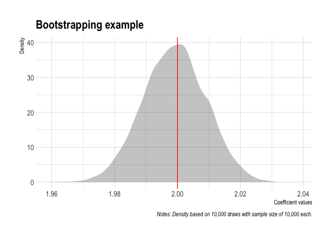

Parallel Programming
================

  - [Example 1](#example-1)
  - [Example 2](#example-2)
      - [Serial implementation (for
        comparison)](#serial-implementation-for-comparison)
      - [Parallel implementation using the future
        ecosystem](#parallel-implementation-using-the-future-ecosystem)
          - [future.apply](#futureapply)
          - [furrr](#furrr)
          - [pbapply](#pbapply)
      - [Results](#results)
  - [General parallel programming
    topics](#general-parallel-programming-topics)
      - [Terminology](#terminology)
      - [Forking vs Sockets](#forking-vs-sockets)
  - [Explicit vs implicit
    parallelization](#explicit-vs-implicit-parallelization)
      - [BLAS/LAPACK](#blaslapack)
      - [Beware resource competition](#beware-resource-competition)
  - [Miscellaneous](#miscellaneous)
      - [When should I go parallel?](#when-should-i-go-parallel)
      - [How many cores should I use?](#how-many-cores-should-i-use)
      - [Fault tolerance (error catching, caching,
        etc)](#fault-tolerance-error-catching-caching-etc)
      - [Random number generation](#random-number-generation)
      - [Parallel regression](#parallel-regression)
      - [CPUs vs GPUs](#cpus-vs-gpus)
      - [Monitoring multicore
        performance](#monitoring-multicore-performance)
  - [Further resources](#further-resources)

## Example 1

``` r
library(tidyverse)

## Emulate slow function
slow_square <- 
  function(x = 1) {
    x_sq <- x^2 
    df <- tibble(value=x, value_squared=x_sq)
    Sys.sleep(2)
    return(df)
    }
```

Let’s iterate over this slow function using the standard `lapply()`.
Note that the iteration is executed in *serial*.

``` r
library(tictoc) ## For timing the function

tic()
serial_ex <- lapply(1:12, slow_square) %>% bind_rows()
toc()
```

    ## 24.059 sec elapsed

We can speed things up by iterating in *parallel*.

Our ability to go parallel hinges on the number of CPU cores.

``` r
library(parallel)
detectCores()
```

    ## [1] 4

Let’s implement parallel iteration using the
[**future.apply**](https://cran.r-project.org/web/packages/future.apply/index.html)
package. Just use `future_apply()` in place of `lapply()`:

``` r
library(future.apply)
plan(multiprocess)

tic()
future_ex <- future_lapply(1:12, slow_square) %>% bind_rows()
toc()
```

    ## 7.068 sec elapsed

If you prefer `purrr::map()` for iteration, use the
[**furrr**](https://davisvaughan.github.io/furrr/index.html) package for
parallelization. Just tell R we want to run things in parallel with
`plan(multiprocess)` and slightly amend the map call to
`future_map_dfr()`:

``` r
library(furrr)
# plan(multiprocess) ## Already set

tic()
furrr_ex <- future_map_dfr(1:12, slow_square)
toc()
```

    ## 6.324 sec elapsed

## Example 2

A more realistic, actually computationally heavy example: boostrapping
coefficient values for hypothesis testing.

Start by creating a fake data set `our_data` and specifying a
bootstrapping function `bootstrp()`. This function will draw a sample of
10K observations from the data set, fit a regression, and then extract
the coefficient on the `x` variable. The estimate is expected to be ~2
given how the random data is generated.

``` r
## Set seed (for reproducibility)
set.seed(1234)
# Set sample size
n <- 1e6

## Generate a large data frame of fake data for a regression
our_data <- 
  tibble(x = rnorm(n), e = rnorm(n)) %>%
  mutate(y = 3 + 2*x + e)

## Function that draws a sample of 10K observations, runs a regression and extracts
## the coefficient value on the x variable (should be around 2).
bootstrp <- 
  function(i) {
  ## Sample the data
  sample_data <- sample_n(our_data, size = 1e4, replace = T)
  ## Run the regression on our sampled data and extract the extract the x coefficient.
  x_coef <- lm(y ~ x, data = sample_data)$coef[2]
  ## Return value
  return(tibble(x_coef = x_coef))
  }
```

### Serial implementation (for comparison)

``` r
set.seed(123L) ## Optional to ensure that the results are the same

## 10,000-iteration simulation
tic()
sim_serial <- lapply(1:1e4, bootstrp) %>% bind_rows()
toc(log = TRUE)
```

    ## 52.911 sec elapsed

### Parallel implementation using the future ecosystem

The “future” package provides the framework for other packages to
implement parallel versions of their functions. This includes
**future.apply** and **furrr**.

#### future.apply

`future.apply::future_lapply()` implementation:

``` r
# library(future.apply)  ## Already loaded
# plan(multiprocess) ## Already set

## 10,000-iteration simulation
tic()
sim_future <- future_lapply(1:1e4, bootstrp, future.seed=123L) %>% bind_rows()
toc()
```

    ## 20.038 sec elapsed

#### furrr

`furrr::future_map_dfr()` implementation: (Note, furrr supports progress
bars.)

``` r
# library(furrr)  ## Already loaded
# plan(multiprocess) ## Already set

## 10,000-iteration simulation
tic()
sim_furrr <- future_map_dfr(1:1e4, bootstrp, .options=future_options(seed=123L))
toc()
```

    ## 18.254 sec elapsed

#### pbapply

Outside the **future** framework,
[**pbapply**](https://github.com/psolymos/pbapply) is a wrapper around
the \*apply functions that adds a progress bar. It has multicore
implementation - just add `cl=<#ofCORES>` to the call:

``` r
set.seed(123) ## Optional to ensure results are exactly the same.

# library(pbapply) ## Already loaded

## 10,000-iteration simulation
tic()
sim_pblapply <- pblapply(1:1e4, bootstrp, cl = parallel::detectCores()) %>% bind_rows()
toc()
```

### Results

It was much faster, but not 4x as fast, despite having 4 cores. There is
*overhead* with running parallel implementations - extra work involved
in splitting up, moving, and re-joining the processes.

Why not plot our result:

``` r
sim_furrr %>%
  ggplot(aes(x_coef)) +
  geom_density(col=NA, fill="gray25", alpha=0.3) +
  geom_vline(xintercept=2, col="red") +
  labs(
    title = "Bootstrapping example",
    x="Coefficient values", y="Density",
    caption = "Notes: Density based on 10,000 draws with sample size of 10,000 each."
    )
```

<!-- -->

## General parallel programming topics

### Terminology

  - **Socket**: Physical connection on your computer that houses the
    processor. Most work and home PCs (even high-end ones) have only one
    socket.
  - **Core**: Part of the processor that performs the computation.
    Modern processors have multiple cores. Each core can perform
    entirely separate and independent computations.
  - **Process**: A single instance of a running task or program. A
    single core can run only one process at a time. However, it can give
    the appearance of running multiple processes by efficiently
    scheduling between them.
  - **Thread**: A component or subset of a process that can share memory
    and resources with other threads.
  - **Cluster**: A collection of objects capable of hosting cores. Could
    range from a single socket to an array of servers.
  - **Hyperthreading**: Technology by Intel, allowing a core to switch
    rapidly between two tasks, giving similar performance to an extra
    physical core.

Check how many CPUs you have:

``` r
# library(RhpcBLASctl) ## Already loaded
get_num_procs() ## No. of all cores (including logical/hyperthreaded)
```

    ## [1] 4

``` r
get_num_cores() ## No. of physical cores only
```

    ## [1] 4

### Forking vs Sockets

[Grant’s full explanation of forking vs
sockets](https://raw.githack.com/uo-ec510-2020-spring/lectures/master/11-parallel/11-parallel.html#forking_vs_sockets).

The general rule of thumb is that you should use forking if it is
available to you. This is the heuristic that the future ecosystem
follows via the `plan(multiprocess)`
function.

| Forking                                                                   | Parallel socket                                                                |
| ------------------------------------------------------------------------- | ------------------------------------------------------------------------------ |
| ✓ Faster and more memory efficient than sockets.                          | × Slower and more memory-intensive than forking.                               |
| ✓️ Trivial to implement.                                                  | × Harder to implement.                                                         |
| × Only available for Unix-based systems like Linux and Mac (not Windows). | ✓ Works on every operating system (including Windows).                         |
| × Can cause problems when running through a GUI or IDE like RStudio.      | ✓ ️No risk of cross-contamination, since each process is run as a unique node. |

## Explicit vs implicit parallelization

We’ve covered *explicit* parallelization above. *Implicit*
parallelization is where certain low-level functions and operations are
automatically run in parallel regardless of whether you told R to do so.
Combining explicit and implicit parallelization can cause issues.

### BLAS/LAPACK

R, Python, and other programs use BLAS (Basic Linear Algebra
Subprograms) and LAPACK (Linear Algebra Package), low-level routines, to
provide the linear algebra framework that supports virtually all
computational programming.

R ships with its own BLAS/LAPACK libraries by default. These place a
premium on stability. You can get significant speedups from switching to
a version more optimized for your system, like the [Intel Math Kernel
Library (MKL)](https://software.intel.com/en-us/mkl) or
[OpenBLAS](https://www.openblas.net/). These support multithreading.

Check which BLAS/LAPACK library you’re running:

``` r
sessionInfo()[c("BLAS", "LAPACK")]
```

    ## $BLAS
    ## [1] "/Library/Frameworks/R.framework/Versions/4.0/Resources/lib/libRblas.dylib"
    ## 
    ## $LAPACK
    ## [1] "/Library/Frameworks/R.framework/Versions/4.0/Resources/lib/libRlapack.dylib"

### Beware resource competition

If you mix explicit and implicit parallel calls (like using the
parallelized **data.table** functions within a `future_lapply()` call),
you risk competing with yourself for memory. Often it makes effectively
no difference, but in some cases it does. You can prevent this by
turning off BLAS multi-threading (which has virtually no impact on
performance):

``` r
# blas_get_num_procs() ## If you want to find the existing number of BLAS threads
RhpcBLASctl::blas_set_num_threads(1) ## Set BLAS threads to 1 (i.e. turn off multithreading)
```

This will only stay in effect for the current R session.

## Miscellaneous

### When should I go parallel?

Short answer: Whenever you’re faced with a so-called [“embarassingly
parallel”](https://en.wikipedia.org/wiki/Embarrassingly_parallel)
problem. Basically, if the computational problems are easy to break up
into smaller chunks. Classic examples are bootstrapping (since each
regression or resampling iteration is drawn independently) and Markov
chain Monte Carlo
([MCMC](https://en.wikipedia.org/wiki/Markov_chain_Monte_Carlo).)

The computational overhead component of a problem dinimishes in size as
the overall computation time increases. Basically, parallelization is
not worth it for simple, short code. The longer your code takes to run,
the smaller fraction the overhead.

Conversely, there are diminishing returns to parallelization. Using lots
of cores only helps if a very large percent of your code can be
parallelized.

### How many cores should I use?

Most people recommend `detectCores() - 1` so your PC will keep running
OK in the meantime. You could use all your cores though. And if you’re
using a cloud machine, you might as well use all its cores.

### Fault tolerance (error catching, caching, etc)

The worst thing about parallel computation is that it’s very sensitive
to failure in any one of its nodes. Parallel functions tend to ignore or
hide critical errors until the end when they’re supposed to return
output. Use persistent caching and proactive error catching to guard
against this.

### Random number generation

RNG can become problematic in parallel computations (whether trying to
maintain identical or different RNG across processes). R has safeguards
against this and future automatically handles RNG via the `future.seed`
argument.

### Parallel regression

Many regression packages in R are optimized to run in parallel. The
superb [fixest](https://github.com/lrberge/fixest/wiki) and
[lfe](https://cran.r-project.org/web/packages/lfe/index.html) packages
automatically invoke multicore capabilities when fitting high
dimensional fixed effects models.
[rStan](https://cran.r-project.org/web/packages/rstan/vignettes/rstan.html#running-multiple-chains-in-parallel)
is a Bayesian package capable of fitting regression models by running
MCMC chains in parallel.
[partools](https://cran.r-project.org/web/packages/partools/index.html)
provides convenient aliases for running a variety of statistical models
and algorithms in parallel.

### CPUs vs GPUs

GPUs excel at some non-graphic computation tasks. Each GPU comprises
thousands of cores. They are useful for deep learning, for example.

### Monitoring multicore performance

Bash-compatible shells come with the `top` command, which shows current
processes and resource consumption. An enhanced alternative is
[htop](https://hisham.hm/htop/).

## Further resources

  - The [furrr package
    vignette](https://davisvaughan.github.io/furrr/index.html).
  - The [future](https://cran.r-project.org/web/packages/future/)
    package vignettes.
  - Dirk Eddelbuettel provides a comprehensive overview of all things R
    parallel in his new working paper, [Parallel Computing With R: A
    Brief Review](https://arxiv.org/abs/1912.11144). I’m confident that
    this will become the authoritative reference once it is published.
  - Many resources online detail older parallel programming methods in R
    (`foreach`, `mclapply`, `parLapply`, `snow`, etc.). While these
    methods have been superseded by the future package ecosystem in my
    mind, there is still a lot of valuable information to be gleaned
    from understanding them. Two great resources are: [How-to go
    parallel in
    R](http://gforge.se/2015/02/how-to-go-parallel-in-r-basics-tips/)
    and [Beyond Single-Core
    R](https://github.com/ljdursi/beyond-single-core-R).
