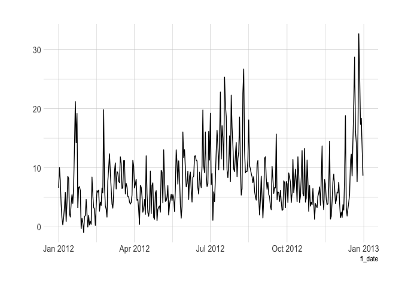

Spark
================

#### Resources:

  - [*Mastering Spark with R*](https://therinspark.com/)
  - The [**sparklyr** website](https://spark.rstudio.com/)

#### Contents:

  - [Setup](#setup)
    
      - [R packages](#r-packages)
      - [Data](#data)

  - [Example 1: Working with distributed
    files](#example-1--working-with-distributed-files)
    
      - [Instatiate a (local) Spark
        connection](#instatiate-a--local--spark-connection)
      - [Map (read in) files](#map--read-in--files)
      - [Run a query](#run-a-query)
      - [Caching a Spark table
        (i.e. DataFrame)](#caching-a-spark-table--ie-dataframe-)
      - [Plot with dbplot](#plot-with-dbplot)

  - [Example 2: Machine learning](#example-2--machine-learning)
    
      - [Prep the data](#prep-the-data)
    
      - [Models](#models)
        
          - [Logistic regression](#logistic-regression)
          - [Random forest](#random-forest)
          - [Neural network](#neural-network)
          - [Model comparison](#model-comparison)
    
      - [Disconnect](#disconnect)

## Setup

``` r
## Install Apache Spark
library(sparklyr)
sparklyr::spark_install()
```

Spark specifically requires Java 8:

    $ brew cask install adoptopenjdk/openjdk/adoptopenjdk8

``` r
## Set Java path in R to the Java 8 directory
Sys.setenv(JAVA_HOME = "/Library/Java/JavaVirtualMachines/adoptopenjdk-8.jdk/Contents/Home")

# Linux: /usr/lib/jvm/java-8-openjdk
# Mac: /Library/Java/JavaVirtualMachines/adoptopenjdk-8.jdk/Contents/Home
# Windows: C:/Program Files/Java/jre1.8.0_241 ## At time of writing

## Check java version
system("java -version")
```

### R packages

``` r
## Load/install packages
if (!require("pacman")) install.packages("pacman")
```

    ## Loading required package: pacman

``` r
pacman::p_load(tidyverse, hrbrthemes, httr, sparklyr, dbplot, here)
## My preferred ggplot2 theme (optional)
theme_set(hrbrthemes::theme_ipsum())
```

### Data

``` r
# library(here) ## Already loaded
# library(httr) ## Already loaded
# library(stringr) ## Already loaded (via tidyverse)

dir_path <- here("lectures/spark/data/")

## Create data sub-directory if it doesn't already exist
if (!dir.exists(dir_path)) dir.create(dir_path)

## Next, we download the 2012 air traffic data from Revolution Analytics...
# First set the base URL
base_url <- "https://packages.revolutionanalytics.com/datasets/AirOnTimeCSV2012/"
# Quick way to get a vector of the hosted CSV files
csvs <- GET(base_url) %>% content("text") %>% str_extract_all("airOT2012...csv") %>% unlist() %>% unique()
# Loop over all the files and download to disk
lapply(
  csvs, 
  function(x) {
    out_path <- paste0(dir_path, x)
    ## Only download the files if they don't already exist
    if (!file.exists(out_path)) {
      GET(
        url = paste0(base_url, x), 
        write_disk(paste0(dir_path, x)), 
        progress()
      )
    }
  }
) 
```

``` r
# list.files(dir_path)
```

## Example 1: Working with distributed files

You may often need to combine a collection of data files into a single
dataset. A natural approach is to read all of the files into your
preferred data analysis environment (e.g. R) and then combine them
within this environment. You may even use a sophisticated loop that does
all the reading and merging programmatically in parallel. However, even
this sophisticated approach runs up against the “in-memory” bottleneck
(data larger than your RAM).

Let’s explore how Spark can be deployed to tackle this kind of issue.
We’ll be using using the monthly air traffic data for 2012 that we
downloaded earlier.

### Instatiate a (local) Spark connection

Instantiate a Spark connection with `sparklyr::spark_connect()`. This
will be similar to database connections we saw in the previous lecture.
I’ll call my Spark connection `sc`. Note that I also specify a “local”
Spark instance because I’m working on my laptop, as opposed to a remote
server or cluster.

``` r
# library(sparklyr) ## Already loaded

## Optional: Give our Spark instance a bit more memory
config <- spark_config()
config$spark.executor.memory <- "4G"

## Instantiate a Spark connection
sc <- spark_connect(master = "local", config = config, version = "2.3")
```

Then a “Connections” tab will open in RStudio. It is currently empty.

### Map (read in) files

Load some data into our empty `sc` connection by reading in the 12 CSV
files that we downloaded earlier, using `sparklyr::spark_read_csv()`.

The main argument below that I want to emphasise is `path`. While it’s
possible to feed it a single CSV, here I am specifying the actual
directory. Spark will automatically map all the CSVs in this directory
and merge them into a single table on the connection.

We should give the resulting table a name (my choice: “air”) that
distinguishes it in the Spark connection panel. We can also reference it
from R by assigning the spark\_read\_csv result to an object name (my
choice: “air\_spark”).

``` r
air_spark <- 
 spark_read_csv(
  sc,                                 ## name of Spark connection
  name = "air",                       ## name of resulting table on connection
  path = here("lectures/spark/data/"),## directory containing the files
  memory = FALSE,                     ## should the table be cached? (not yet)
  infer_schema = FALSE                ## infer column types (requires an extra pass over the data)
  )
```

``` r
air_spark
```

    ## # Source: spark<air> [?? x 45]
    ##    YEAR  MONTH DAY_OF_MONTH DAY_OF_WEEK FL_DATE UNIQUE_CARRIER TAIL_NUM FL_NUM
    ##    <chr> <chr> <chr>        <chr>       <chr>   <chr>          <chr>    <chr> 
    ##  1 2012  7     1            7           2012-0… AA             N322AA   1     
    ##  2 2012  7     2            1           2012-0… AA             N325AA   1     
    ##  3 2012  7     3            2           2012-0… AA             N322AA   1     
    ##  4 2012  7     4            3           2012-0… AA             N336AA   1     
    ##  5 2012  7     5            4           2012-0… AA             N321AA   1     
    ##  6 2012  7     6            5           2012-0… AA             N339AA   1     
    ##  7 2012  7     7            6           2012-0… AA             N328AA   1     
    ##  8 2012  7     8            7           2012-0… AA             N328AA   1     
    ##  9 2012  7     9            1           2012-0… AA             N336AA   1     
    ## 10 2012  7     10           2           2012-0… AA             N335AA   1     
    ## # … with more rows, and 37 more variables: ORIGIN_AIRPORT_ID <chr>,
    ## #   ORIGIN <chr>, ORIGIN_STATE_ABR <chr>, DEST_AIRPORT_ID <chr>, DEST <chr>,
    ## #   DEST_STATE_ABR <chr>, CRS_DEP_TIME <chr>, DEP_TIME <chr>, DEP_DELAY <chr>,
    ## #   DEP_DELAY_NEW <chr>, DEP_DEL15 <chr>, DEP_DELAY_GROUP <chr>,
    ## #   TAXI_OUT <chr>, WHEELS_OFF <chr>, WHEELS_ON <chr>, TAXI_IN <chr>,
    ## #   CRS_ARR_TIME <chr>, ARR_TIME <chr>, ARR_DELAY <chr>, ARR_DELAY_NEW <chr>,
    ## #   ARR_DEL15 <chr>, ARR_DELAY_GROUP <chr>, CANCELLED <chr>,
    ## #   CANCELLATION_CODE <chr>, DIVERTED <chr>, CRS_ELAPSED_TIME <chr>,
    ## #   ACTUAL_ELAPSED_TIME <chr>, AIR_TIME <chr>, FLIGHTS <chr>, DISTANCE <chr>,
    ## #   DISTANCE_GROUP <chr>, CARRIER_DELAY <chr>, WEATHER_DELAY <chr>,
    ## #   NAS_DELAY <chr>, SECURITY_DELAY <chr>, LATE_AIRCRAFT_DELAY <chr>,
    ## #   `_c44` <chr>

### Run a query

``` r
# library(tidyverse)

mean_dep_delay <- 
  air_spark %>%
  group_by(MONTH) %>%
  summarise(mean_delay = mean(DEP_DELAY))
```

The above works instantaneously to perform a *lazy query*. The
`mean_dep_delay` object hasn’t actually been created yet; it’s just a
pointer to a set of aspirational commands. To actually execute the query
and pull the resulting object into our R environment, use
`dplyr::collect()`.

``` r
# mean_dep_delay %>% show_query() ## Optional: Show the Spark SQL translation
mean_dep_delay <- collect(mean_dep_delay)
```

    ## Warning: Missing values are always removed in SQL.
    ## Use `mean(x, na.rm = TRUE)` to silence this warning
    ## This warning is displayed only once per session.

``` r
mean_dep_delay
```

    ## # A tibble: 12 x 2
    ##    MONTH mean_delay
    ##    <chr>      <dbl>
    ##  1 1           5.75
    ##  2 5           6.93
    ##  3 2           4.23
    ##  4 8          10.3 
    ##  5 3           7.70
    ##  6 4           4.70
    ##  7 12         11.1 
    ##  8 7          13.0 
    ##  9 6           9.43
    ## 10 10          7.19
    ## 11 9           6.42
    ## 12 11          5.76

Note that the “MONTH” column is not ordered and that it has also been
parsed as a character instead of numeric. We could have guarded against
this if we’ve changed the `infer_schema = FALSE` argument to TRUE in the
`spark_read_csv()` call above. (Omitting it would have had the same
effect since it would default to TRUE.) I did this deliberately to save
on the initial read time. However, we’ll have a chance to fix this in
the next section.

### Caching a Spark table (i.e. DataFrame)

Let’s subset our Spark data to only a few columns. I’ll rename them in
the process (since I prefer to work with lower case variable names) and
then also convert these variables to the correct type (e.g. dates and
numeric).

More importantly, however, I’m also going to go ahead and cache the
resulting table in Spark’s memory allocation to improve performance.
There are various configurations and considerations that we’d normally
want to weigh before caching a Spark table — see
[here](https://spark.rstudio.com/guides/caching/) — but the default
settings will suffice for this simple example. In truth, the benefit
from explicit caching is not clear for this particular example, since
the whole dataset is small enough to be held in memory regardless. But I
again just want to demonstrate some general principles that would apply
when working with much bigger data.

``` r
air_cached <- 
  air_spark %>%
  ## Select (and rename) a subset of variables
  select(
    fl_date = FL_DATE, month = MONTH, dep_time = DEP_TIME, arr_time = ARR_TIME, 
    arr_delay = ARR_DELAY, dep_delay = DEP_DELAY, distance = DISTANCE,
    sched_dep_time = CRS_DEP_TIME, sched_arr_time = CRS_ARR_TIME
    ) %>%
  ## Can't use lubridate functions like ymd(), but as.Date() works for Spark SQL tables 
  mutate(fl_date = as.Date(fl_date)) %>%
  ## Convert all other variables to numeric
  mutate_at(vars(-fl_date), as.numeric) %>%
  ## Register resulting Spark SQL in Spark connection
  sdf_register("air_cached")

## Cache it (i.e. load in memory for performance)
tbl_cache(sc, "air_cached")

## Preview it
air_cached
```

    ## # Source: spark<air_cached> [?? x 9]
    ##    fl_date    month dep_time arr_time arr_delay dep_delay distance
    ##    <date>     <dbl>    <dbl>    <dbl>     <dbl>     <dbl>    <dbl>
    ##  1 2012-07-01     7      851     1156        -4        -9     2475
    ##  2 2012-07-02     7      915     1153        -4        15     2475
    ##  3 2012-07-03     7      851     1126       -31        -9     2475
    ##  4 2012-07-04     7      852     1110       -47        -8     2475
    ##  5 2012-07-05     7      900     1123       -34         0     2475
    ##  6 2012-07-06     7      857     1109       -48        -3     2475
    ##  7 2012-07-07     7      912     1149        -8        12     2475
    ##  8 2012-07-08     7      922     1224        27        22     2475
    ##  9 2012-07-09     7      853     1130       -27        -7     2475
    ## 10 2012-07-10     7      853     1132       -25        -7     2475
    ## # … with more rows, and 2 more variables: sched_dep_time <dbl>,
    ## #   sched_arr_time <dbl>

Tip: Open the Spark web UI (`spark_web(sc)`) and click the “Storage” tab
to see which of your tables are cached and held in memory.

### Plot with dbplot

We can use [**dbplot**](https://db.rstudio.com/dbplot/) to perform plot
calculations inside the Spark connection (i.e. database). While this is
probably overkill for the particular example below, dbplot’s database
plotting functionality is extremely useful for extracting insights from
really large Spark tables.

``` r
# library(dbplot) ## Already loaded

air_cached %>%
  dbplot_line(fl_date, mean(dep_delay)) ## line graph  of mean departure delay by date
```

<!-- -->

At this point, we’d normally disconnect from our sc connection using
`spark_disconnect(sc)`. But I want to keep it open for our second use
case example…

## Example 2: Machine learning

Some of the most exciting applications of Spark involve machine
learning; both through its built-in
[MLlib](http://spark.rstudio.com/mlib/) library and its seamless
interface to external platforms like H2O’s [Sparkling
Water](https://www.h2o.ai/sparkling-water/). But, here’s a simple
example that uses our cached flights data to predict arrival delays with
different algorithms.

### Prep the data

For this simple example, I’m not going to worry about scaling or any of
the other feature engineering tricks that we’d normally heed in a
real-life ML problem. Instead, I’m just going to create a binary (1/0)
variable called “late”, which records whether a flight arrived more than
15 minutes behind schedule. In other words, this is going to be a
classification problem.

As ever with prediction algorithms, we also need to partition our data
into random samples for testing and validation. This will help us avoid
overfitting. In this case, I’m only going to use 10% of the data for
model building and testing. This 10% sample will in turn be split 30-70
between training and testing data, respectively.

``` r
air_sample <- 
  air_cached %>%
  filter(!is.na(arr_delay)) %>%  ## Filter out NAs (important for some ML models)
  ## Create our binary outcome variable: "late" 
  ## Measures whether arrival > 15 min delayed
  ft_binarizer(input_col = "arr_delay", 
               output_col = "late", 
               threshold = 15) %>%
  ## Create a new discretized predictor variable: dep_block
  ## Divides departure times into six evenly-spaced "blocks" (i.e. 4 hours apart)
  ft_bucketizer(input_col = "sched_dep_time", 
                output_col = "dep_block", 
                splits = seq(0, 2400, by = 400)) %>% 
  mutate(dep_block = paste0(as.integer(dep_block))) %>%
  ## Partition the data: Randomly sample 10% for training (7%) and testing (3%)
  sdf_random_split(train = 0.03, test = 0.07, other = 0.9,
                   seed = 123)
```

Register and then cache the sampled tables in our Spark instance:

``` r
air_train <- sdf_register(air_sample$train, "air_train")
tbl_cache(sc, "air_train")

tally(air_train)
```

    ## # Source: spark<?> [?? x 1]
    ##        n
    ##    <dbl>
    ## 1 180009

### Models

``` r
## Define the formula of your model
fml <- late ~ dep_delay + dep_block
```

#### Logistic regression

Using `sparklyr::ml_logistic_regression`:

``` r
log_mod <- 
  air_train %>%
  ml_logistic_regression(fml)

summary(log_mod)
```

    ## Coefficients:
    ## (Intercept)   dep_delay dep_block_2 dep_block_3 dep_block_4 dep_block_1 
    ##  -2.9270045   0.1496785  -0.2824101  -0.2674651  -0.2585541  -0.2046798 
    ## dep_block_5 
    ##  -0.2220930

We can predict on our holdout/testing sample with
`sparklyr::ml_predict()`:

``` r
log_pred <- ml_predict(log_mod, air_sample$test)

## Preview the prediction results
log_pred %>% 
  select(late, prediction, probability) %>% 
  head(5)
```

How did we do overall?

``` r
## Summary metrics:
ml_binary_classification_evaluator(log_pred) ## area under ROC
ml_multiclass_classification_evaluator(log_pred) ## F1 score

## We'll also create a confusion matrix for use later
log_cmat <-
  log_pred %>%
  group_by(late, prediction) %>%
  tally() %>%
  collect()
```

#### Random forest

``` r
## Train the RF model
rf_mod <- 
  air_train %>%
  ml_random_forest(fml, type = "classification")

## Run predictions on test (i.e. holdout) sample
rf_pred <- ml_predict(rf_mod, air_sample$test)

## Preview the prediction results
# rf_pred %>% 
#   select(late, dep_block, prediction) %>% 
#   head(5)

## Summary metrics:
ml_binary_classification_evaluator(rf_pred) ## area under ROC
ml_multiclass_classification_evaluator(rf_pred) ## F1 score

## Create confusion matrix
rf_cmat <-
  rf_pred %>%
  group_by(late, prediction) %>%
  tally() %>%
  collect()
```

#### Neural network

``` r
## Train the neural net
## Note: The number in the first layer must correspond to the number of input 
## features; in this case 6 (i.e. 1 for dep_delay + 5 for the dep_block dummies
## so as to avoid the dummy variable trap). Similarly, the last layer must 
## correspond to the number of output classes; in this case 2 (i.e. late or not 
## late.) The intermediate layers are flexible.
nnet_model <- 
  air_train %>%
  ml_multilayer_perceptron_classifier(fml, layers = c(6, 3, 2))

## Run predictions on test (i.e. holdout) sample
nnet_pred <- ml_predict(nnet_model, air_sample$test)

## Preview the prediction results
# nnet_pred %>%
#   select(late, dep_block, prediction) %>%
#   head(5)

## Summary metrics:
ml_binary_classification_evaluator(nnet_pred) ## area under ROC
ml_multiclass_classification_evaluator(nnet_pred) ## F1 score
## Create confusion matrix
nnet_cmat <-
  nnet_pred %>%
  group_by(late, prediction) %>%
  tally() %>%
  collect()
```

#### Model comparison

We can compare our three confusion matrices now. The logistic model does
(slightly) better on true positives, whilst the random forest does
(slightly) better on true negatives. The neural net is somewhere in the
middle. All three tend to underestimate the number of late arrivals.

``` r
bind_rows(
  log_cmat %>% mutate(mod = "Logistic regression"), 
  rf_cmat %>% mutate(mod = "Random forest"),
  nnet_cmat %>% mutate(mod = "Neural network")
  ) %>% 
  pivot_wider(names_from = mod, values_from = n)
```

And in plot form:

``` r
bind_rows(
  log_cmat %>% mutate(mod = "Logistic regression"), 
  rf_cmat %>% mutate(mod = "Random forest"), 
  nnet_cmat %>% mutate(mod = "Neural network")
  ) %>%
  mutate(mod = factor(mod, levels = c("Logistic regression", "Random forest", "Neural network"))) %>%
  mutate_at(vars(late, prediction), factor) %>%
  ggplot(aes(x = late, y = n, fill = prediction)) +
  geom_col(alpha = 0.5) + 
  scale_fill_brewer(palette = "Set1") +
  scale_y_continuous(labels = scales::comma) + 
  labs(
    title = "Predicting late arrivals: Model performance",
    x = "observation"
    ) +
  facet_wrap(~ mod) + 
  theme(
    axis.title.y = element_blank(),
    panel.grid.major.x = element_blank()
    )
```

### Disconnect

Remember to disconnect from Spark.

``` r
spark_disconnect(sc)
```
