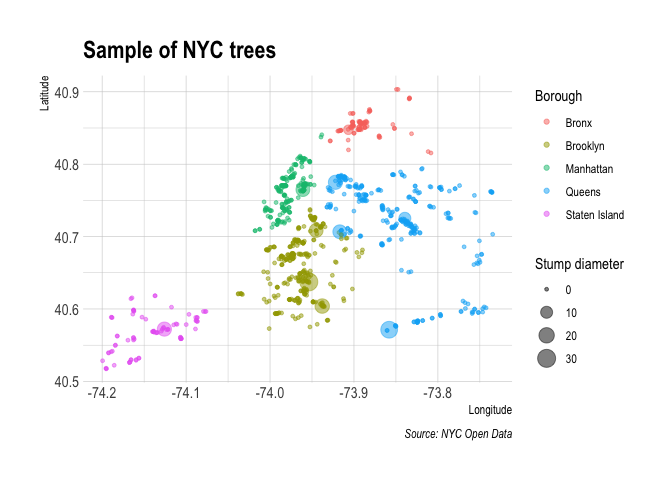
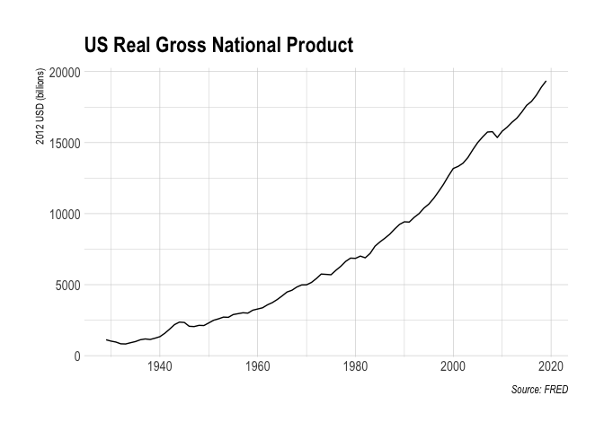
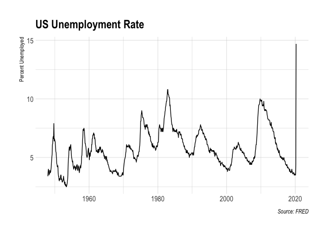

Web scraping (APIs)
================

  - An API is a set of rules/methods that allow one computer or program
    (e.g. host server) to communicate with another (e.g. client or
    browser).
  - We can access information through an API directly by specifying a
    valid API endpoint.
  - Some APIs don’t require an access key or token, but most do. You can
    add the key as a parameter in the API endpoint.
  - To download from an API endpoint, use:
      - `jsonlite::readJSON()` to read a JSON array
      - `httr::GET()` to read the whole API response
      - or use a package that does the work for you, like `fredr`

**Contents:**

  - [Client-side, APIs, and API
    endpoints](#client-side,-apis,-and-api-endpoints)
  - [APIs](#apis)
  - [Application 1: Trees of New York
    City](#application-1:-trees-of-new-york-city)
  - [Application 2: FRED data](#application-2:-fred-data)
  - [Safely store and use API keys as environment
    variables](#safely-store-and-use-api-keys-as-environment-variables)
  - [Application 3: World rugby
    rankings](#application-3:-world-rugby-rankings)
      - [Locating a hidden API
        endpoint](#locating-a-hidden-api-endpoint)
  - [Extra resources and exercises](#extra-resources-and-exercises)

## Client-side, APIs, and API endpoints

Recall that websites or applications that are built using a client-side
framework typically involve something like the following steps:

  - You visit a URL that contains a template of static content (HTML
    tables, CSS, etc.). This template itself doesn’t contain any data.
  - However, in the process of opening the URL, your browser sends a
    request to the host server.
  - If your request if valid, then the server issues a response that
    fetches the necessary data for you and renders the page dynamically
    in your browser.
  - The page that you actually see in your browser is thus a mix of
    static content and dynamic information that is rendered by your
    browser (i.e. the “client”).

All of this requesting, responding and rendering takes places through
the host application’s API (or Application Programming Interface).

## APIs

For a thorough introduction: [An Introduction to
APIs](https://zapier.com/learn/apis/)

  - **Server:** A powerful computer that runs an API.
  - **Client:** A program that exchanges data with a server through an
    API.
  - **Protocol:** The “etiquette” underlying how computers talk to each
    other (e.g. HTTP).
  - **Methods:** The “verbs” that clients use to talk with a server. The
    main one that we’ll be using is GET (i.e. ask a server to retrieve
    information), but other common methods are POST, PUT and DELETE.
  - **Requests:** What the client asks of the server (see Methods
    above).
  - **Response:** The server’s response. This includes a Status Code
    (e.g. “404” if not found, or “200” if successful), a *Header*
    (i.e. meta-information about the reponse), and a *Body* (i.e the
    actual content that we’re interested in).

We can access information *directly* from the API database if we can
specify the correct URL(s). These URLs are called **API endpoints**.
They are usually **JSON** (JavaScript Object Notation) or **XML**
(Extensible Markup Language).

## Application 1: Trees of New York City

[NYC Open Data](https://opendata.cityofnewyork.us/) is a cool and very
extensive data source. It compiles all the data from all local
government agencies.

We’ll use the [2015 Street Tree
Census](https://data.cityofnewyork.us/Environment/2015-Street-Tree-Census-Tree-Data/uvpi-gqnh).

``` r
# library(jsonlite)
nyc_trees <- 
  fromJSON("https://data.cityofnewyork.us/resource/uvpi-gqnh.json") %>%
  as_tibble()
nyc_trees
```

    ## # A tibble: 1,000 x 45
    ##    tree_id block_id created_at tree_dbh stump_diam curb_loc status health
    ##    <chr>   <chr>    <chr>      <chr>    <chr>      <chr>    <chr>  <chr> 
    ##  1 180683  348711   2015-08-2… 3        0          OnCurb   Alive  Fair  
    ##  2 200540  315986   2015-09-0… 21       0          OnCurb   Alive  Fair  
    ##  3 204026  218365   2015-09-0… 3        0          OnCurb   Alive  Good  
    ##  4 204337  217969   2015-09-0… 10       0          OnCurb   Alive  Good  
    ##  5 189565  223043   2015-08-3… 21       0          OnCurb   Alive  Good  
    ##  6 190422  106099   2015-08-3… 11       0          OnCurb   Alive  Good  
    ##  7 190426  106099   2015-08-3… 11       0          OnCurb   Alive  Good  
    ##  8 208649  103940   2015-09-0… 9        0          OnCurb   Alive  Good  
    ##  9 209610  407443   2015-09-0… 6        0          OnCurb   Alive  Good  
    ## 10 192755  207508   2015-08-3… 21       0          OffsetF… Alive  Fair  
    ## # … with 990 more rows, and 37 more variables: spc_latin <chr>,
    ## #   spc_common <chr>, steward <chr>, guards <chr>, sidewalk <chr>,
    ## #   user_type <chr>, problems <chr>, root_stone <chr>, root_grate <chr>,
    ## #   root_other <chr>, trunk_wire <chr>, trnk_light <chr>, trnk_other <chr>,
    ## #   brch_light <chr>, brch_shoe <chr>, brch_other <chr>, address <chr>,
    ## #   zipcode <chr>, zip_city <chr>, cb_num <chr>, borocode <chr>,
    ## #   boroname <chr>, cncldist <chr>, st_assem <chr>, st_senate <chr>, nta <chr>,
    ## #   nta_name <chr>, boro_ct <chr>, state <chr>, latitude <chr>,
    ## #   longitude <chr>, x_sp <chr>, y_sp <chr>, council_district <chr>,
    ## #   census_tract <chr>, bin <chr>, bbl <chr>

Note: the online dataset is 700k rows, but the API defaults to a limit
of 1,000 rows.

Change the limit with `$limit`, for example to 5
    rows:

  - `fromJSON("https://data.cityofnewyork.us/resource/uvpi-gqnh.json?$limit=5)`

Note `jsonlite::fromJSON()` coerces all values to character format, in
order to be safe. So we need to fix our column types.

``` r
nyc_trees %>%
  select(longitude, latitude, stump_diam, boroname, spc_common, tree_id) %>%
  mutate(longitude = as.numeric(longitude),
         latitude = as.numeric(latitude),
         stump_diam = as.numeric(stump_diam)) %>%
  ggplot(aes(x=longitude,
             y=latitude,
             size=stump_diam,
             color=boroname)) +
  geom_point(alpha=0.5) +
  scale_size_continuous(name="Stump diameter") +
  labs(x = "Longitude", y = "Latitude",
       color = "Borough",
       title = "Sample of NYC trees",
       caption = "Source: NYC Open Data")
```

<!-- -->

## Application 2: FRED data

We can access FRED data via the FRED API. You need to [register an API
KEY](https://research.stlouisfed.org/useraccount/apikey) on their site
first. You can read the [FRED API development
docs](https://research.stlouisfed.org/docs/api/fred/) to learn how to
access their data. We are interested in collecting
**series/observations**. For this, the docs specify some parameters of
interest:

  - **file\_type**: “json” (Not required, but our preferred type of
    output.)
  - **series\_id**: “GNPCA” (Required. The data series that we want.)
  - **api\_key**: “YOUR\_API\_KEY” (Required.)

Combine these parameters with the endpoint path. Then we can go to the
resulting URL in our
    browser:

  - <https://api.stlouisfed.org/fred/series/observations?series_id=GNPCA&api_key=YOUR_API_KEY&file_type=json>

We could use `jsonlite::readJSON()` to read the JSON object into R, but
the **httr** package has some features that allow us to interact more
flexibly and securely with web APIs.

Start by creating “convenience variables”:

``` r
endpoint = "series/observations"
params = list(
  api_key= Sys.getenv("FRED_API_KEY"), ## See below for how to set your keys
  file_type="json", 
  series_id="GNPCA"
  )
```

Use `httr::GET()` to request (download) the data.

``` r
fred <- 
  httr::GET(
    url = "https://api.stlouisfed.org/", ## Base URL
    path = paste0("fred/", endpoint), ## The API endpoint
    query = params ## The parameter list defined above
  )
fred
```

    ## Response [https://api.stlouisfed.org/fred/series/observations?api_key=fac08e14d0563cf1c2d24ef9be2487d3&file_type=json&series_id=GNPCA]
    ##   Date: 2020-05-08 22:33
    ##   Status: 200
    ##   Content-Type: application/json; charset=UTF-8
    ##   Size: 9.29 kB

To extract the content/data from this response, use `httr::content()`.
Since the content is a JSON array, we can convert it to an R object with
`jsonlite::fromJSON()`. Then, since the result is a list, we can try the
`listviewer::jsonedit()` for interactive inspection.

``` r
fred %>%
  httr::content("text") %>%  ## Extract the content/data from the API response
  jsonlite::fromJSON() %>%  ## Convert it to an R object
# listviewer::jsonedit("view")  ## Open an interactive inspector
  str()  ## Inspect structure
```

    ## List of 13
    ##  $ realtime_start   : chr "2020-05-08"
    ##  $ realtime_end     : chr "2020-05-08"
    ##  $ observation_start: chr "1600-01-01"
    ##  $ observation_end  : chr "9999-12-31"
    ##  $ units            : chr "lin"
    ##  $ output_type      : int 1
    ##  $ file_type        : chr "json"
    ##  $ order_by         : chr "observation_date"
    ##  $ sort_order       : chr "asc"
    ##  $ count            : int 91
    ##  $ offset           : int 0
    ##  $ limit            : int 100000
    ##  $ observations     :'data.frame':   91 obs. of  4 variables:
    ##   ..$ realtime_start: chr [1:91] "2020-05-08" "2020-05-08" "2020-05-08" "2020-05-08" ...
    ##   ..$ realtime_end  : chr [1:91] "2020-05-08" "2020-05-08" "2020-05-08" "2020-05-08" ...
    ##   ..$ date          : chr [1:91] "1929-01-01" "1930-01-01" "1931-01-01" "1932-01-01" ...
    ##   ..$ value         : chr [1:91] "1120.076" "1025.091" "958.378" "834.291" ...

Looks like the `fred$observations` sub-element is what we want.

``` r
fred <- 
  fred %>%
  httr::content("text") %>%  ## Extract the content/data from the API response
  jsonlite::fromJSON() %>%  ## Convert it to an R object
  purrr::pluck("observations") %>%  ## Extract the "$observations" list element
  # .$observations %>%  ## Would also work
  # magrittr:extract("observations") %>%  ## Would also work
  as_tibble()
fred
```

    ## # A tibble: 91 x 4
    ##    realtime_start realtime_end date       value   
    ##    <chr>          <chr>        <chr>      <chr>   
    ##  1 2020-05-08     2020-05-08   1929-01-01 1120.076
    ##  2 2020-05-08     2020-05-08   1930-01-01 1025.091
    ##  3 2020-05-08     2020-05-08   1931-01-01 958.378 
    ##  4 2020-05-08     2020-05-08   1932-01-01 834.291 
    ##  5 2020-05-08     2020-05-08   1933-01-01 823.156 
    ##  6 2020-05-08     2020-05-08   1934-01-01 911.019 
    ##  7 2020-05-08     2020-05-08   1935-01-01 992.537 
    ##  8 2020-05-08     2020-05-08   1936-01-01 1118.944
    ##  9 2020-05-08     2020-05-08   1937-01-01 1177.572
    ## 10 2020-05-08     2020-05-08   1938-01-01 1138.989
    ## # … with 81 more rows

Clean:

``` r
fred <- 
  fred %>%
  select(date, value) %>%
  mutate(date = ymd(date),
         value = as.numeric(value))
```

Plot:

``` r
fred %>%
  ggplot(aes(x = date,
             y = value)) +
  geom_line() +
  labs(x = NULL,
       y = "2012 USD (billions)",
       title = "US Real Gross National Product",
       caption = "Source: FRED")
```

<!-- -->

## Safely store and use API keys as environment variables

#### 1\) Set an environment variable for the current R session only

``` r
## Set new environment variable called MY_API_KEY. Current session only.
Sys.setenv(MY_API_KEY="abcdefghijklmnopqrstuvwxyz0123456789")

## Print the key, after it's defined:
Sys.getenv("MY_API_KEY")
```

    ## [1] "abcdefghijklmnopqrstuvwxyz0123456789"

This is nice because the object won’t be shown in the RStudio
environment pane (it’s safe).

Don’t write `Sys.setenv()` calls in an R Markdown file or other shared
documents - that would defeat the purpose of keeping the keys secure.
Use the console instead.

#### 2\) Set an environment variable that persists across R sessions

To set an R environment variable that’s available across sessions, you
add it to a file called `~/.Renviron`. This is a text file in your home
directory which R reads on startup. You can do this conveniently with
`usethis::edit_r_environ()`.

``` r
## Open your .Renviron file so you can add API keys that persist across sessions
usethis::edit_r_environ()
```

    ## ● Edit '/Users/stephenhaltiner/.Renviron'

    ## ● Restart R for changes to take effect

Insert a line like this:

    MY_API_KEY="abcdefghijklmnopqrstuvwxyz0123456789"

After saving, read the file to make the variable available in your
current session:

``` r
## Refresh your .Renviron file
readRenviron("~/.Renviron")
```

#### Use a package

With R, someone has probably already written a package that does the
heavy API lifting for you. For FRED, there is
[fredr](http://sboysel.github.io/fredr/index.html).

``` r
library(fredr)
fredr(series_id = "UNRATE") %>%
  ggplot(aes(x = date,
             y = value)) +
  geom_line() +
  labs(x = NULL,
       y = "Percent Unemployed",
       title = "US Unemployment Rate",
       caption = "Source: FRED")
```

<!-- -->

## Application 3: World rugby rankings

Using CSS to scaape the [World Rugby
rankings](https://www.world.rugby/rankings/mru) isn’t working. The site
is rendered client-side, so there must be an API. Let’s find it.

#### Locating a hidden API endpoint

  - Inspect the page.
  - Go to the Network tab.
  - Filter by XHR (XML data).
  - Refresh the page.
  - Search through the traffic links to find which one contains the data
    you want. (Check the “response” or “output” to preview the data
    inside.)
  - Copy the URL and preview it in a new tab.

Walkthrough
[here](aster/08-web-api/08-web-api.html#locating_the_hidden_api_endpoint).

We’ll use the `jsonlite` package to pull this into
R.

``` r
endpoint <- "https://cmsapi.pulselive.com/rugby/rankings/mru?language=en&client=pulse"

rugby <- fromJSON(endpoint)
str(rugby)  ## Inspect structure of object
```

    ## List of 3
    ##  $ label    : chr "Mens Rugby Union"
    ##  $ entries  :'data.frame':   105 obs. of  6 variables:
    ##   ..$ team       :'data.frame':  105 obs. of  5 variables:
    ##   .. ..$ id          : int [1:105] 39 37 34 36 42 33 38 35 49 40 ...
    ##   .. ..$ altId       : logi [1:105] NA NA NA NA NA NA ...
    ##   .. ..$ name        : chr [1:105] "South Africa" "New Zealand" "England" "Ireland" ...
    ##   .. ..$ abbreviation: chr [1:105] "RSA" "NZL" "ENG" "IRE" ...
    ##   .. ..$ annotations : logi [1:105] NA NA NA NA NA NA ...
    ##   ..$ matches    : int [1:105] 212 220 208 199 203 216 227 194 174 190 ...
    ##   ..$ pts        : num [1:105] 94.2 92.1 88.4 84.9 82.7 ...
    ##   ..$ pos        : int [1:105] 1 2 3 4 5 6 7 8 9 10 ...
    ##   ..$ previousPts: num [1:105] 94.2 92.1 88.3 84.9 83.9 ...
    ##   ..$ previousPos: int [1:105] 1 2 3 4 5 6 7 8 9 10 ...
    ##  $ effective:List of 3
    ##   ..$ millis   : num 1.58e+12
    ##   ..$ gmtOffset: num 0
    ##   ..$ label    : chr "2020-03-09"

It’s a nested list, and it looks like $entries is what we want.
Investigate further:

``` r
str(rugby$entries)  ## Base option
```

    ## 'data.frame':    105 obs. of  6 variables:
    ##  $ team       :'data.frame': 105 obs. of  5 variables:
    ##   ..$ id          : int  39 37 34 36 42 33 38 35 49 40 ...
    ##   ..$ altId       : logi  NA NA NA NA NA NA ...
    ##   ..$ name        : chr  "South Africa" "New Zealand" "England" "Ireland" ...
    ##   ..$ abbreviation: chr  "RSA" "NZL" "ENG" "IRE" ...
    ##   ..$ annotations : logi  NA NA NA NA NA NA ...
    ##  $ matches    : int  212 220 208 199 203 216 227 194 174 190 ...
    ##  $ pts        : num  94.2 92.1 88.4 84.9 82.7 ...
    ##  $ pos        : int  1 2 3 4 5 6 7 8 9 10 ...
    ##  $ previousPts: num  94.2 92.1 88.3 84.9 83.9 ...
    ##  $ previousPos: int  1 2 3 4 5 6 7 8 9 10 ...

``` r
# listviewer::jsonedit(rugby, mode = "view") ## Interactive option
```

``` r
head(rugby$entries$team)
```

    ##   id altId         name abbreviation annotations
    ## 1 39    NA South Africa          RSA          NA
    ## 2 37    NA  New Zealand          NZL          NA
    ## 3 34    NA      England          ENG          NA
    ## 4 36    NA      Ireland          IRE          NA
    ## 5 42    NA       France          FRA          NA
    ## 6 33    NA        Wales          WAL          NA

It looks like we could bind (append) the columns of `rugby$entries$team`
to the other elements of `rugby$entries`. Then all the data would be in
a single table.

``` r
# library(janitor)
rankings <- 
  bind_cols(rugby$entries$team,
            rugby$entries %>% select(-team)
            ) %>%
  clean_names() %>%
  select(-c(id, alt_id, annotations)) %>%  ## These columns aren't needed
  select(pos, pts, everything()) %>%  ## Reorder columns
  as_tibble()
rankings
```

    ## # A tibble: 105 x 7
    ##      pos   pts name         abbreviation matches previous_pts previous_pos
    ##    <int> <dbl> <chr>        <chr>          <int>        <dbl>        <int>
    ##  1     1  94.2 South Africa RSA              212         94.2            1
    ##  2     2  92.1 New Zealand  NZL              220         92.1            2
    ##  3     3  88.4 England      ENG              208         88.3            3
    ##  4     4  84.9 Ireland      IRE              199         84.9            4
    ##  5     5  82.7 France       FRA              203         83.9            5
    ##  6     6  82.6 Wales        WAL              216         82.8            6
    ##  7     7  81.9 Australia    AUS              227         81.9            7
    ##  8     8  80.7 Scotland     SCO              194         79.6            8
    ##  9     9  79.3 Japan        JPN              174         79.3            9
    ## 10    10  78.3 Argentina    ARG              190         78.3           10
    ## # … with 95 more rows

For a tutorial on scraping the records from different points in time,
then wrangling and plotting, see
[here](https://raw.githack.com/uo-ec510-2020-spring/lectures/master/08-web-api/08-web-api.html#bonus:_get_and_plot_the_rankings_history).

## Extra resources and exercises

  - [Here](https://www.pscp.tv/w/1ynKOpVnERrGR) is a short video stream
    by Grant for scraping traffic fatality data from [LA’s Open Data
    portal](https://data.lacity.org/). Expands a bit on using API
    parameters to query (i.e. wrangle and summarise) data directly up on
    the host server before scraping it.
  - Several cool [blog posts](https://tclavelle.github.io/blog/) on
    interacting with APIs through R. I especially recommend going over —
    and replicating — the excellent [tutorial on the GitHub
    API](https://tclavelle.github.io/blog/r_and_apis/).
  - A post on RStudio’s *R Views* blog, “[GDP Data via
    API](https://rviews.rstudio.com/2018/09/12/gdp-via-api/)” treads a
    similar path to the FRED example. Except he uses the Bureau of
    Economic Analysis (BEA) API.
  - “[Web Scraping 201: finding the
    API](http://www.gregreda.com/2015/02/15/web-scraping-finding-the-api/)”
    covers much of the same ground as we have here. While it focuses on
    Python tools, I’ve found it to be a handy reference. (Earlier posts
    in Greg’s webscraping series —
    [Part 1](http://www.gregreda.com/2013/03/03/web-scraping-101-with-python/)
    and
    [Part 2](http://www.gregreda.com/2013/04/29/more-web-scraping-with-python/)
    — to see some Python equivalents of the `rvest` tools that we’ve
    been using.)
  - Using Python for “[Discovering hidden
    APIs](https://ianlondon.github.io/blog/web-scraping-discovering-hidden-apis/)”
    from Airbnb.
