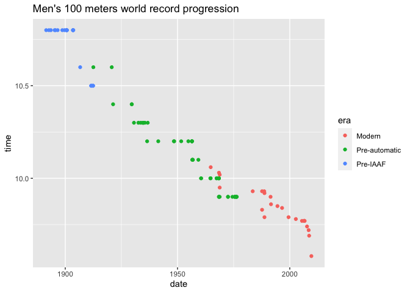

webscraping-CSS
================

  - Web content is rendered either 1) server-side or 2) client-side.
  - To scrape content rendered **server-side**, we must know the
    relevant **CSS selectors**.
  - Find the CSS selectors with a browser extension or by using “inspect
    element”.
  - Use the `rvest` package to read the HTML doc into R and parse the
    relevant nodes.
      - A typical workflow: `read_html(URL) %>%
        html_nodes(CSS_SELECTORS) %>% html_table(fill=TRUE)`.
      - You may need other functions depending on content type (e.g.
        `html_text()`)
  - Web scraping requires lots of experimenting and cleaning.

**Contents:**

  - [Be polite](#be-polite)
  - [rvest (for server-side)](#rvest-\(for-server-side\))
  - [Exercise](#exercise)

## Be polite

The [polite](https://github.com/dmi3kno/polite) package provides tools
to help maintain web etiquette while scraping (checking for permission,
not hammering the host website with requests, etc).

## rvest (for server-side)

rvest is designed to work with web pages that are built server-side and
thus requires knowledge of the relevant CSS selectors.

CSS has two main features:

  - *Properties:* the “how” of display rules (e.g. fonts, styles,
    colors, page width)
  - *Selectors:* the “what” of display rules (identify which properties
    should be applied to which elements; e.g. top-line text headers are
    labeled “.h1”; subheaderes are “.h2”)

<!-- end list -->

``` r
# library(rvest)
m100 <- read_html("https://en.wikipedia.org/wiki/Men%27s_100_metres_world_record_progression")
m100
```

    ## {html_document}
    ## <html class="client-nojs" lang="en" dir="ltr">
    ## [1] <head>\n<meta http-equiv="Content-Type" content="text/html; charset=UTF-8 ...
    ## [2] <body class="mediawiki ltr sitedir-ltr mw-hide-empty-elt ns-0 ns-subject  ...

This creates an XML document containing the whole webpage.

Let’s try to isolate a table on this page using
SelectorGadget/ScrapeMate browser extension:

``` r
m100 %>%
html_nodes("div+ .wikitable td , div+ .wikitable th") %>%
html_table(fill=TRUE)
```

    ## Error in html_table.xml_node(X[[i]], ...): html_name(x) == "table" is not TRUE

Didn’t work. Sometimes you have to use Inspect Element instead to get
the right CSS selector. Let’s try this one:

``` r
pre_iaaf <-
  m100 %>%
  html_nodes("table.wikitable:nth-child(8)") %>%
  html_table(fill=TRUE)
  
class(pre_iaaf)  ## Check class of the output
```

    ## [1] "list"

The output from this is actually a list of lists… so let’s convert it to
a data frame with `dplyr::bind_rows()`.

``` r
# pre_iaaf <- pre_iaaf[[1]] ## Would also work

# library(dplyr)
pre_iaaf <-
  pre_iaaf %>%
  bind_rows() %>%
  as_tibble()

# library(janitor)
pre_iaaf <- clean_names(pre_iaaf) ## Clean column names
pre_iaaf
```

    ## # A tibble: 21 x 5
    ##     time athlete            nationality    location_of_races     date           
    ##    <dbl> <chr>              <chr>          <chr>                 <chr>          
    ##  1  10.8 Luther Cary        United States  Paris, France         July 4, 1891   
    ##  2  10.8 Cecil Lee          United Kingdom Brussels, Belgium     September 25, …
    ##  3  10.8 Étienne De Ré      Belgium        Brussels, Belgium     August 4, 1893 
    ##  4  10.8 L. Atcherley       United Kingdom Frankfurt/Main, Germ… April 13, 1895 
    ##  5  10.8 Harry Beaton       United Kingdom Rotterdam, Netherlan… August 28, 1895
    ##  6  10.8 Harald Anderson-A… Sweden         Helsingborg, Sweden   August 9, 1896 
    ##  7  10.8 Isaac Westergren   Sweden         Gävle, Sweden         September 11, …
    ##  8  10.8 10.8               Sweden         Gävle, Sweden         September 10, …
    ##  9  10.8 Frank Jarvis       United States  Paris, France         July 14, 1900  
    ## 10  10.8 Walter Tewksbury   United States  Paris, France         July 14, 1900  
    ## # … with 11 more rows

As seen above, there is an issue: Westergen’s second entry is recorded
incorrectly - where his name should be, his time is there instead. Let’s
write a simple
fix:

``` r
## See if possible to convert the 'athlete' column to numeric. If possible, replace the cell with the preceding value.

pre_iaaf <-
  pre_iaaf %>%
  mutate(athlete = ifelse(is.na(as.numeric(athlete)), athlete, lag(athlete)))
```

    ## Warning in ifelse(is.na(as.numeric(athlete)), athlete, lag(athlete)): NAs
    ## introduced by coercion

Finally, convert date column from chr format to date format:

``` r
# library(lubridate)
pre_iaaf <-
  pre_iaaf %>%
  mutate(date = mdy(date))
pre_iaaf
```

    ## # A tibble: 21 x 5
    ##     time athlete               nationality    location_of_races       date      
    ##    <dbl> <chr>                 <chr>          <chr>                   <date>    
    ##  1  10.8 Luther Cary           United States  Paris, France           1891-07-04
    ##  2  10.8 Cecil Lee             United Kingdom Brussels, Belgium       1892-09-25
    ##  3  10.8 Étienne De Ré         Belgium        Brussels, Belgium       1893-08-04
    ##  4  10.8 L. Atcherley          United Kingdom Frankfurt/Main, Germany 1895-04-13
    ##  5  10.8 Harry Beaton          United Kingdom Rotterdam, Netherlands  1895-08-28
    ##  6  10.8 Harald Anderson-Arbin Sweden         Helsingborg, Sweden     1896-08-09
    ##  7  10.8 Isaac Westergren      Sweden         Gävle, Sweden           1898-09-11
    ##  8  10.8 Isaac Westergren      Sweden         Gävle, Sweden           1899-09-10
    ##  9  10.8 Frank Jarvis          United States  Paris, France           1900-07-14
    ## 10  10.8 Walter Tewksbury      United States  Paris, France           1900-07-14
    ## # … with 11 more rows

## Exercise

Scrape all the tables, combine, and make a plot.

``` r
## Get next table
iaaf_1 <-
  m100 %>%
  html_nodes("table.wikitable:nth-child(14)") %>%
  html_table(fill=TRUE) %>%
  bind_rows() %>%
  as_tibble() %>%
  clean_names()
  
## Fix blank athlete, clean dates
iaaf_1 <- 
  iaaf_1 %>%
  mutate(athlete = if_else(athlete=="", lag(athlete), athlete)) %>%
  mutate(date = mdy(date))
```

    ## Warning: 3 failed to parse.

``` r
## Fix blank dates
iaaf_1 <- 
  iaaf_1 %>%
  mutate(date = if_else(is.na(date), lag(date), date))
```

``` r
## Get final table
iaaf_2 <- 
  m100 %>%
  html_nodes("table.wikitable:nth-child(19)") %>%
  html_table(fill = TRUE) %>%
  bind_rows() %>%
  as_tibble() %>%
  clean_names()
  
## Clean dates
iaaf_2 <- 
  iaaf_2 %>%
  mutate(date = mdy(date))

## Don't bother fixing the other issues, at least we can graph times against date.
```

``` r
## Combine data frames
wr100 <- 
  bind_rows(
    pre_iaaf %>% select(time, date) %>% mutate(era = "Pre-IAAF"),
    iaaf_1 %>% select(time, date) %>% mutate(era = "Pre-automatic"),
    iaaf_2 %>% select(time, date) %>% mutate(era = "Modern")
  )

## Plot
wr100 %>%
  ggplot() +
  geom_point(mapping = aes(x = date, y = time, color = era)) +
  labs(title = "Men's 100 meters world record progression")
```

<!-- -->
